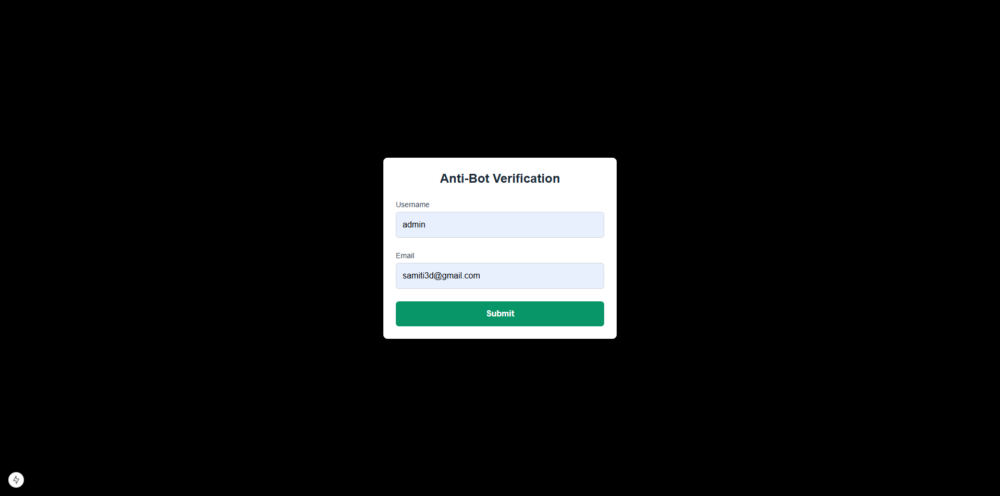

# AntiBot Form Project

Welcome to the **AntiBot Form Project**! This project demonstrates a simple anti-bot form with CSRF protection and a basic layout built with Next.js, React, and Tailwind CSS.

## Overview

This project includes:
- A custom `AntiBotForm` component for user data input.
- CSRF token fetching for protection against Cross-Site Request Forgery.
- A modern and professional design using Tailwind CSS.

## Installation

To get started, clone this repository and install the dependencies.

```bash
git clone https://github.com/samitixyz/AntiBotForm.git
cd antibot-form-project
npm install
